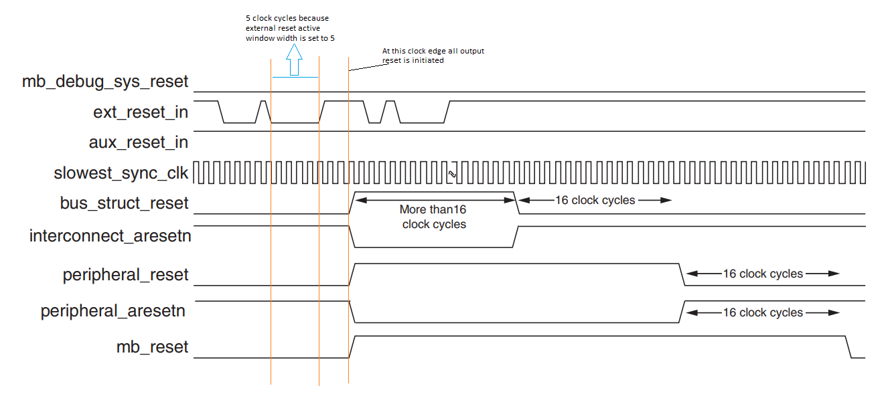

## Xilinx FPGA global PL reset

In this article we'll discuss about the ```Processing System Reset``` Vivado IP. It handles the all programmable logic reset system.
Upon POR a reset is hit on the ```ext_reset_in``` input through the last EMIO. If input reset remains active for atleast 5 clock cycles then all resets become active on the same positive edge of clock.
Here below is a sequence when releasing a input reset signal.

1- The first reset signals to go inactive are the ```bus_struct_reset``` and ```interconnect_aresetn```.

2- 16 clocks later ```peripheral_reset``` and ```peripheral_aresetn``` go inactive.

3- 16 clocks later ```mb_reset``` goes inactive. Now all the resets are inactive and processing
can begin

***Important:*** Once trigger the input ```ext_reset_in``` for 5-10 clock cycles then it must be brought back to normal state so all output resets can complete their reset sequence within 32 clock cycle.

### Reset timing sequecne:


### Simulation


